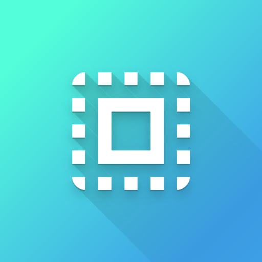

#  My WebView


### Description
* My WebView, my choice!
* Developed based LineageOS 22.2 (A15).

### Build

```shell
git clone https://github.com/ketikai/MyWebView.git
cd ./MyWebView
./gradlew assemble
```

### Links
* [AnyWebView](https://github.com/neoblackxt/AnyWebView)